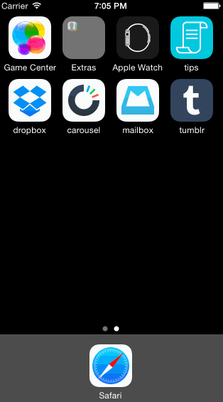

# CodePath Week 4 Project: Tumblr

In this exercise, I've leveraged animations and gestures to create custom navigation in a Tumblr app prototype.

Time spent: 10 hours in total

####Required stories
* [x] Tapping on Home, Search, Account, or Trending should show the respective screen and highlight the tab bar button.
* [x] Compose button should modally present the compose screen.

####Optional stories
* [x] Optional: Compose screen is faded in while the buttons animate in.
* [x] Optional: Login button should animate the login form over the view controller (using custom view controller transition).
* [x] Optional: Discover bubble should bob up and down unless the SearchViewController is tapped.

####Walkthrough:

GIF created with [LiceCap](http://www.cockos.com/licecap/).
